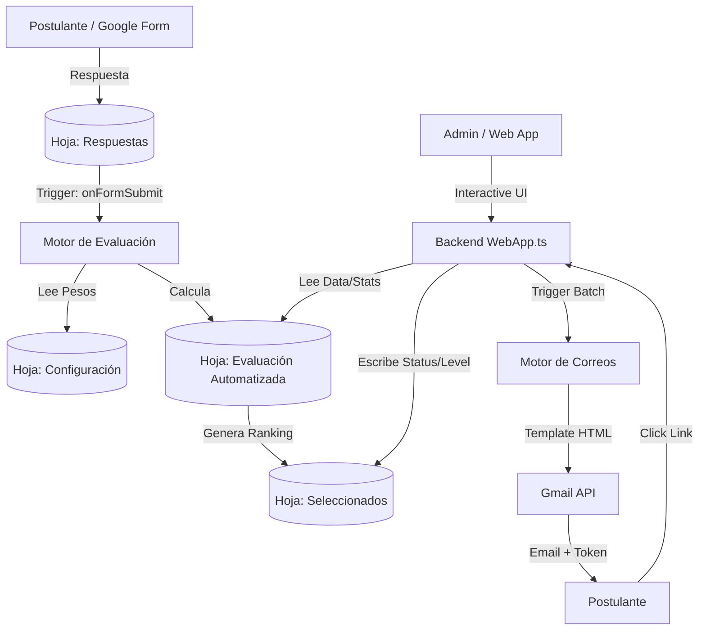

# Arquitectura del Sistema — v5.0

## Resumen Ejecutivo

El sistema **PUCV2English** ha sido migrado de un script monolítico legado a una arquitectura modular profesional escrita en **TypeScript**. Utiliza un enfoque de "Frontend decoupled" donde el Google Sheet actúa como base de datos persistente y una Aplicación Web dinámica actúa como la consola administrativa de "Mission Control".

## Diagrama de Flujo de Datos

---

## Desglose de Módulos (src/)

### 1. `Config.ts` (Core)

- **Propósito:** Definición de Tipos, Interfaces e Inyección de Dependencias.
- **Responsabilidad:** Mantiene el objeto `CONFIG` (mapeo de columnas) y `PROGRAM_DATA` (fechas, semestres). Centraliza la tipificación de `IApplicant`.

### 2. `Evaluacion.ts` (Engine)

- **Propósito:** El "cerebro" matemático del sistema.
- **Responsabilidad:** Implementa `evaluarPostulacionesPUCV2()`. Utiliza sub-funciones atomizadas para cada criterio (UsoIngles, Certificado, Internacionalización).

### 3. `WebApp.ts` (API Layer)

- **Propósito:** Servir la interfaz y manejar peticiones asíncronas.
- **Responsabilidad:** Ruteo de `doGet`, generación de tokens de seguridad y procesamiento de acciones asíncronas (`updateApplicantStatus`, `getSelectionData`).

### 4. `Correos.ts` (Communication)

- **Propósito:** Gestión de la capa de salida de emails.
- **Responsabilidad:** Renderizado de plantillas HTML dinámicas y envío en batch con control de cuotas y prevención de duplicados.

### 5. `Seleccionados.ts` (State Machine)

- **Propósito:** Gestión de cupos y movimientos de lista.
- **Responsabilidad:** Detecta rechazos y activa automáticamente la promoción del siguiente candidato en el ranking.

### 6. `Dashboard.ts` (Analytics)

- **Propósito:** Generación de reportes tabulares en Sheets.
- **Responsabilidad:** Transforma datos crudos de evaluación en métricas resumen dentro del ecosistema de Google Sheets.

---

## Capa de Usuario (UI)

- **Native Sheets Menu:** Punto de entrada integrado para acciones rápidas.
- **HTML Sidebars:** Diálogos ligeros dentro de Sheets para configuración rápida (pesos de evaluación).
- **Web App Dashboard:** Aplicación SPA (Single Page Application) completa con Chart.js para análisis profundo y gestión masiva.

---

## Deuda Técnica v5.0

- [ ] **Tests Unitarios:** A pesar de la modularidad, no existen tests automatizados para la lógica de puntuación.
- [x] **Email Quota Guard:** Implementado en `Correos.ts` con chequeo preventivo antes de envíos en batch.
- [ ] **Cache Service:** La carga de datos en la Web App podría optimizarse usando `CacheService` para las estadísticas más pesadas.
- [ ] **Error UI:** Los errores del servidor en la Web App se muestran solo en consola/logs; falta una UI de error más amigable para el usuario.
