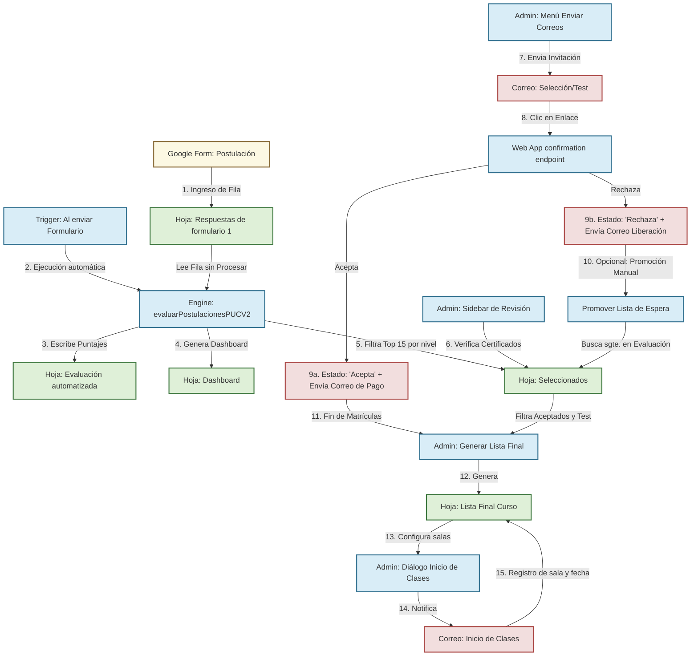

# Flujo Lógico y Operación de Scripts (PUCV2English)

Este documento detalla la arquitectura, requerimientos y secuencia de ejecución del sistema modular **PUCV2English**, diseñado para la gestión y evaluación automatizada de postulaciones.

---

## 🗺️ Diagrama del Flujo de Trabajo General

El siguiente diagrama ilustra el ciclo de vida completo de una postulación, desde el formulario inicial hasta el inicio de clases:

---

## 🧩 Componentes y Requerimientos de los Scripts

A continuación, se detalla qué requiere y qué produce cada script de la carpeta `src/`.

### 1. [Config.ts](file:///c:/Users/Usuario/Documents/code\pucv\PUCV2\src\Config.ts)
*   **Propósito**: Centraliza tipos, interfaces y objetos globales de configuración.
*   **Requerimientos / Entradas**:
    *   La hoja de cálculo activa de Google Sheets (contenedor).
    *   Una hoja llamada `"Configuración"` para persistir configuraciones personalizadas del usuario.
*   **Salidas / Modificaciones**:
    *   Expone el objeto `CONFIG` con los nombres exactos de las hojas y columnas del formulario.
    *   Expone los parámetros de puntuación predeterminados (`DEFAULT_SCORING_PARAMS`) y de programa (`DEFAULT_PROGRAM_DATA`).
*   **Funciones clave**:
    *   `cargarConfiguracionDesdeHoja()`: Lee pesos y configuraciones de la hoja `"Configuración"`.
    *   `saveConfiguracion(data)`: Guarda en la hoja `"Configuración"` los cambios de pesos hechos desde el sidebar.
    *   `resetConfiguracion()`: Borra la hoja `"Configuración"` y restablece valores predeterminados en memoria.

### 2. [Evaluacion.ts](file:///c:/Users/Usuario/Documents/code\pucv\PUCV2\src\Evaluacion.ts)
*   **Propósito**: Motor de cálculo que evalúa postulaciones aplicando criterios de ponderación.
*   **Requerimientos / Entradas**:
    *   Hoja `"Respuestas de formulario 1"` con datos estructurados y los encabezados exactos detallados en `CONFIG.COLUMNS`.
    *   Columna `"Estado de Procesamiento"` agregada al final de la hoja de respuestas.
*   **Salidas / Modificaciones**:
    *   Sobrescribe la hoja `"Evaluación automatizada"`.
    *   Actualiza la columna `"Estado de Procesamiento"` en `"Respuestas de formulario 1"` con la marca de tiempo de la evaluación.
    *   Ejecuta la actualización en cadena de la hoja `"Seleccionados"` y del `"Dashboard"`.
*   **Funciones clave**:
    *   `evaluarPostulacionesPUCV2()`: Lee filas no procesadas, realiza la validación de duplicados por correo, calcula los puntajes detallados, escribe los resultados e invoca a las hojas derivadas.
    *   `calcularPuntajeUsoIngles()`, `calcularPuntajeInternacionalizacion()`, `calcularPuntajeCertificado()`, `calcularPuntajeAnioIngreso()`: Funciones modulares que calculan los puntajes de acuerdo al perfil del postulante (Estudiante vs Académico/Funcionario).

### 3. [Seleccionados.ts](file:///c:/Users/Usuario/Documents/code\pucv\PUCV2\src\Seleccionados.ts)
*   **Propósito**: Seleccionar y ordenar a los postulantes para determinar quiénes obtienen cupo.
*   **Requerimientos / Entradas**:
    *   Los resultados generados por el motor de evaluación (`resultados`).
    *   La hoja `"Evaluación automatizada"` (para buscar reemplazos en lista de espera).
*   **Salidas / Modificaciones**:
    *   Sobrescribe la hoja `"Seleccionados"` ordenando a los candidatos por nivel y puntaje total.
    *   Aplica validación de datos a las columnas de gestión (`Aceptación` [Acepta, Rechaza, Pendiente], `Verificación Certificado` [Válido, Test de nivel], `Nivel Asignado` [B1+, B2.1, B2.2, C1]).
    *   Aplica formato condicional de color (verde para aceptados, rojo para rechazados).
*   **Funciones clave**:
    *   `generarHojaSeleccionados()`: Filtra y extrae el **Top 15 por nivel** (B1+, B2.1, B2.2, C1) priorizando puntaje (descendente) y rompiendo empates por marca temporal (más antiguo primero).
    *   `gestionarListaDeEspera(nivelTarget)`: Busca al candidato no seleccionado más alto de ese nivel, lo promueve agregándolo a `"Seleccionados"`, y le envía de forma automática el correo de invitación.

### 4. [Correos.ts](file:///c:/Users/Usuario/Documents/code\pucv\PUCV2\src\Correos.ts)
*   **Propósito**: Encargado del envío de correos masivos o unitarios a partir de plantillas HTML personalizadas.
*   **Requerimientos / Entradas**:
    *   Hojas `"Seleccionados"` y `"Evaluación automatizada"`.
    *   Plantillas HTML: `CorreoSeleccionado`, `CorreoTestNivel`, `CorreoListaEspera`, `CorreoNoSeleccionado`, `CorreoHandPicked`, `CorreoConfirmacionAcepta`, `CorreoConfirmacionRechaza`.
*   **Salidas / Modificaciones**:
    *   Envía correos electrónicos a través de `GmailApp`.
    *   Registra la fecha y hora en la columna `"Fecha Notificación"` de `"Seleccionados"` para asegurar idempotencia.
*   **Funciones clave**:
    *   `sendEmailBatch(type)`: Envía invitaciones masivas en base al estado de la columna `Verificación Certificado` (`'Válido'` -> Correo de Selección; `'Test de nivel'` -> Correo para examen de nivel). Valida cuota restante diaria con `MailApp.getRemainingDailyQuota()`.
    *   `enviarCorreoConfirmacion(correo, tipoConfirmacion)`: Envía correos automáticos posteriores a la acción de aceptar (con link de pago y plazo) o rechazar.

### 5. [InicioClases.ts](file:///c:/Users/Usuario/Documents/code\pucv\PUCV2\src\InicioClases.ts)
*   **Propósito**: Notificar el inicio del curso a los alumnos definitivamente matriculados.
*   **Requerimientos / Entradas**:
    *   Hoja `"Lista Final Curso"`.
    *   Plantilla HTML `CorreoInicioClases`.
    *   Entrada de texto del administrador para definir las salas físicas/virtuales de cada nivel.
*   **Salidas / Modificaciones**:
    *   Envía correos con horarios, sala y fechas a través de `GmailApp`.
    *   Escribe la sala en la columna `"Sala"` y la fecha de envío en `"Notificado Inicio"` de la hoja `"Lista Final Curso"`.
*   **Funciones clave**:
    *   `getNivelesActivos()`: Obtiene niveles en `"Lista Final Curso"` con alumnos confirmados no notificados.
    *   `guardarSalasYObtenerPreview(salas)`: Guarda temporalmente la relación nivel-sala y retorna un preview.
    *   `enviarCorreosInicioClases()`: Ejecuta la lógica final de envío de correos y marcas de tiempo.

### 6. [ListaFinal.ts](file:///c:/Users/Usuario/Documents/code\pucv\PUCV2\src\ListaFinal.ts)
*   **Propósito**: Generar la lista definitiva de alumnos listos para el curso o el test de nivel.
*   **Requerimientos / Entradas**:
    *   Hoja `"Seleccionados"`.
*   **Salidas / Modificaciones**:
    *   Sobrescribe la hoja `"Lista Final Curso"`.
*   **Funciones clave**:
    *   `generarListaFinalCurso()`: Filtra candidatos que marcaron `"Acepta"` con nivel asignado OR aquellos cuya verificación de certificado exige `"Test de nivel"`. Los agrupa en secciones organizadas visualmente con subencabezados.

### 7. [WebApp.ts](file:///c:/Users/Usuario/Documents/code\pucv\PUCV2\src\WebApp.ts)
*   **Propósito**: Maneja el panel de control administrativo web (UI principal) y los endpoints para que los postulantes confirmen o liberen su cupo.
*   **Requerimientos / Entradas**:
    *   Acceso a `ScriptProperties` para almacenar y validar tokens temporales UUID de confirmación.
    *   `index.html` para la interfaz del panel.
*   **Salidas / Modificaciones**:
    *   Registros de aceptación/rechazo en la hoja `"Seleccionados"`.
    *   Páginas web dinámicas de confirmación para los postulantes.
*   **Funciones clave**:
    *   `doGet(e)`: Enrutador principal. Si recibe `action` y `token`, procesa la decisión del postulante; si no, muestra el Panel de Control Administrativo.
    *   `procesarAccionPostulante(token, action)`: Valida el token único. Si es real, actualiza la hoja `"Seleccionados"`, destruye el token por seguridad (un solo uso), envía el correo de confirmación respectivo y retorna un mensaje de éxito con enlace de pago si aceptó.
    *   `generarToken(correo)`: Genera un UUID único en ScriptProperties para el postulante de manera transaccional.

### 8. [Utils.ts](file:///c:/Users/Usuario/Documents/code\pucv\PUCV2\src\Utils.ts)
*   **Propósito**: Funciones de soporte transversales (normalización, logs de depuración, conversiones de celdas).

---

## 🔄 Flujo de Trabajo Operacional (Paso a Paso)

El ciclo operativo consta de las siguientes iteraciones coordinadas:

### Paso 1: Inicialización y Parámetros
1. El Administrador publica la **Web App** en Google Apps Script (`Implementar > Nueva Implementación > Aplicación Web`).
2. Configura la URL resultante de la Web App en `CONFIG.WEB_APP_URL` en [Config.ts](file:///c:/Users/Usuario/Documents/code\pucv\PUCV2\src\Config.ts) para la generación de enlaces de correo.
3. Configura los horarios del programa y los pesos de ponderación en el menú `PUCV2English` > `⚙️ Configurar Pesos` (que lee y escribe en la pestaña `"Configuración"`).

### Paso 2: Admisión de Postulaciones y Puntuación
1. Los postulantes completan el formulario de Google. Las respuestas se graban en `"Respuestas de formulario 1"`.
2. Un activador (trigger) automático de Apps Script ejecuta `evaluarPostulacionesPUCV2()` al enviar el formulario (o el administrador lo fuerza desde la hoja con `📊 Evaluar Postulaciones`).
3. El motor calcula el puntaje y actualiza:
    *   La hoja `"Evaluación automatizada"` (listado de puntuaciones).
    *   La hoja `"Dashboard"` (gráficos y métricas de balance).
    *   La hoja `"Seleccionados"` (Top 15 por nivel de inglés en estado `"Pendiente"`).

### Paso 3: Validación Administrativa de Certificados
1. El administrador ingresa a `PUCV2English` > `👁️ Revisar Postulaciones` (o directamente en la hoja `"Seleccionados"`).
2. Para cada uno de los 60 postulantes (15 por cada uno de los 4 niveles), el administrador revisa el link de su certificado:
    *   Si es correcto: Configura `Verificación Certificado` = `"Válido"`.
    *   Si no tiene certificado válido: Configura `Verificación Certificado` = `"Test de nivel"`.

### Paso 4: Notificación y Decisiones de Postulantes
1. Desde el menú `📧 Enviar Correos` -> `✅ Seleccionados`, el administrador notifica a los postulantes válidos. Esto envía un correo con enlaces únicos para **Aceptar** o **Rechazar**.
2. Desde el menú `📧 Enviar Correos` -> `🧪 Test de Nivel`, se notifica a los candidatos sin certificado para que rindan el examen de nivelación.
3. El postulante recibe el correo y da clic en un botón:
    *   **Aceptar**: El sistema cambia su estado a `"Acepta"` en la hoja `"Seleccionados"`, borra su token y le envía un correo de confirmación (`CorreoConfirmacionAcepta`) con la URL de MercadoPago configurada para abonar su matrícula en un plazo máximo de `DEADLINE_DAYS` (por defecto 3 días).
    *   **Rechazar**: El sistema cambia su estado a `"Rechaza"` en la hoja, borra su token y envía el correo `CorreoConfirmacionRechaza`.

### Paso 5: Gestión de Lista de Espera (Iterativo)
1. Si un postulante seleccionado hace clic en **Rechazar** (o vence su plazo de matrícula), se libera un cupo en dicho nivel.
2. Desde el Panel de Control Web o mediante API (`promoverSiguienteEsperaAPI(nivel)`), el administrador promueve al siguiente candidato.
3. El sistema busca de manera automática el postulante mejor puntuado de ese nivel en `"Evaluación automatizada"` que no esté en `"Seleccionados"`, lo ingresa a la hoja como `"Pendiente"` y le gatilla instantáneamente el correo de invitación.

### Paso 6: Generación de Lista Final e Inicio de Clases
1. Una vez cerradas las matrículas, el administrador ejecuta `PUCV2English` > `📋 Generar Lista Final`.
2. El script extrae a todos los postulantes con estado `"Acepta"` y a aquellos en `"Test de nivel"` y genera una visualización estructurada por grupos en la hoja `"Lista Final Curso"`.
3. El administrador registra manualmente los pagos confirmados en la columna `"Pagó (Sí/No)"`.
4. El administrador selecciona `📧 Enviar Correos` > `🏫 Inicio de Clases`, lo que abre un cuadro de diálogo interactivo.
5. El administrador introduce la **sala física o virtual** correspondiente a cada nivel activo.
6. El administrador valida el preview y confirma el envío de correos. Cada alumno confirmado recibe el horario de clases, fecha de inicio/término y su sala asignada. El script registra el timestamp en `"Notificado Inicio"` e ingresa la sala en la fila correspondiente en la hoja `"Lista Final Curso"`.

---

## 🛡️ Robustez, Concurrencia e Idempotencia

*   **Lock Service**: El motor de evaluación y la gestión de lista de espera bloquean la hoja con `LockService` durante el proceso de lectura/escritura para evitar que solicitudes paralelas sobrescriban datos y causen pérdidas de información.
*   **Idempotencia de Envíos**: Cada envío de correo requiere la ausencia del timestamp de notificación en la columna correspondiente (`Fecha Notificación` en `"Seleccionados"` o `Notificado Inicio` en `"Lista Final Curso"`). Una vez enviado con éxito, el timestamp se graba inmediatamente, evitando que envíos accidentales dupliquen correos a los alumnos.
*   **Sandbox de Pruebas**: Si un enlace de confirmación se activa con un token de test que no pertenece a ningún correo de la base de datos real de `"Seleccionados"`, el script de la Web App opera en un modo seguro de simulación (Sandbox), previniendo escrituras erróneas y caídas del script.
