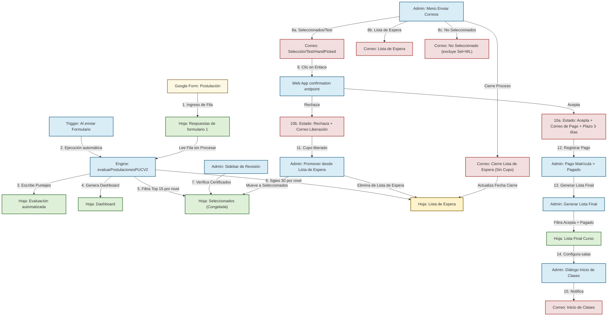

# Flujo Lógico y Operación de Scripts (PUCV2English v2.4.0)

Este documento detalla la arquitectura, requerimientos y secuencia de ejecución del sistema modular **PUCV2English**, diseñado para la gestión y evaluación automatizada de postulaciones.

---

## 🗺️ Diagrama del Flujo de Trabajo General

El siguiente diagrama ilustra el ciclo de vida completo de una postulación, desde el formulario inicial hasta el inicio de clases:

---

## 🧩 Componentes y Requerimientos de los Scripts

A continuación, se detalla qué requiere y qué produce cada script de la carpeta `src/`.

### 1. Config.ts
*   **Propósito**: Centraliza tipos, interfaces y objetos globales de configuración.
*   **Requerimientos / Entradas**:
    *   La hoja de cálculo activa de Google Sheets (contenedor).
    *   Una hoja llamada `"Configuración"` para persistir configuraciones personalizadas del usuario.
*   **Salidas / Modificaciones**:
    *   Expone el objeto `CONFIG` con los nombres exactos de las hojas y columnas del formulario.
    *   Expone los parámetros de puntuación predeterminados (`DEFAULT_SCORING_PARAMS`) y de programa (`DEFAULT_PROGRAM_DATA`).
*   **Funciones clave**:
    *   `cargarConfiguracionDesdeHoja()`: Lee pesos y configuraciones de la hoja `"Configuración"`.
    *   `saveConfiguracion(data)`: Guarda en la hoja `"Configuración"` los cambios de pesos hechos desde el sidebar.
    *   `resetConfiguracion()`: Borra la hoja `"Configuración"` y restablece valores predeterminados en memoria.

### 2. Evaluacion.ts
*   **Propósito**: Motor de cálculo que evalúa postulaciones aplicando criterios de ponderación.
*   **Requerimientos / Entradas**:
    *   Hoja `"Respuestas de formulario 1"` con datos estructurados y los encabezados exactos detallados en `CONFIG.COLUMNS`.
    *   Columna `"Estado de Procesamiento"` agregada al final de la hoja de respuestas.
*   **Salidas / Modificaciones**:
    *   Sobrescribe la hoja `"Evaluación automatizada"`.
    *   Actualiza la columna `"Estado de Procesamiento"` en `"Respuestas de formulario 1"` con la marca de tiempo de la evaluación.
    *   Ejecuta la actualización en cadena de la hoja `"Lista de Espera"` y del `"Dashboard"`.
    *   **No sobreescribe** la hoja `"Seleccionados"` (congelada).
*   **Funciones clave**:
    *   `evaluarPostulacionesPUCV2()`: Lee filas no procesadas, realiza la validación de duplicados por correo, calcula los puntajes detallados, escribe los resultados e invoca a las hojas derivadas.
    *   `calcularPuntajeUsoIngles()`, `calcularPuntajeInternacionalizacion()`, `calcularPuntajeCertificado()`, `calcularPuntajeAnioIngreso()`: Funciones modulares que calculan los puntajes de acuerdo al perfil del postulante.

### 3. Seleccionados.ts
*   **Propósito**: Seleccionar, ordenar y gestionar a los postulantes, incluyendo lista de espera y promociones.
*   **Requerimientos / Entradas**:
    *   Los resultados generados por el motor de evaluación (`resultados`).
    *   La hoja `"Evaluación automatizada"` (para buscar candidatos de lista de espera).
    *   La hoja `"Seleccionados"` existente (para preservar datos y promociones manuales).
*   **Salidas / Modificaciones**:
    *   **`"Seleccionados"` (congelada)**: Solo se genera al inicio; las regeneraciones posteriores no la sobreescriben.
    *   **`"Lista de Espera"`**: Hoja con los siguientes 30 candidatos por nivel, ordenados por puntaje. Preserva las fechas de notificación y cierre existentes.
    *   Aplica validación de datos a las columnas de gestión (`Aceptación`, `Verificación Certificado`, `Nivel Asignado`, `Pago Matrícula`).
    *   Aplica formato condicional de color (verde para aceptados, rojo para rechazados).
*   **Funciones clave**:
    *   `generarHojaSeleccionados()`: Filtra y extrae el **Top 15 por nivel** (B1+, B2.1, B2.2, C1). Solo se ejecuta si la hoja no existe o está vacía.
    *   `generarHojaListaEspera()`: Genera los siguientes 30 candidatos por nivel, preservando las fechas de notificación y cierre existentes, y excluyendo a los ya seleccionados.
    *   `promoverDesdeListaEspera()`: Mueve al candidato seleccionado de la fila activa de la lista de espera a `"Seleccionados"`, lo elimina de la lista de espera y re-secuencia los rankings.
    *   `restaurarHojaSeleccionadosPerdida()`: Recuperación de emergencia con datos backup hardcoded.

### 4. Correos.ts
*   **Propósito**: Motor de envío de correos masivos o unitarios con plantillas HTML personalizadas.
*   **Requerimientos / Entradas**:
    *   Hojas `"Seleccionados"`, `"Lista de Espera"` y `"Evaluación automatizada"`.
    *   Plantillas HTML: `CorreoSeleccionado`, `CorreoTestNivel`, `CorreoHandPicked`, `CorreoListaEspera`, `CorreoEsperaSinCupo`, `CorreoNoSeleccionado`, `CorreoConfirmacionAcepta`, `CorreoConfirmacionRechaza`.
*   **Salidas / Modificaciones**:
    *   Envía correos electrónicos a través de `GmailApp` o crea borradores según la opción elegida.
    *   Registra la fecha y hora en la columna de control correspondiente para asegurar idempotencia.
*   **Tipos de Lote Soportados**:
    *   `SELECTED`: Candidatos con `Verificación Certificado = "Válido"` y sin fecha de notificación.
    *   `TEST_LEVEL_ONLY`: Candidatos con `Verificación Certificado = "Test de nivel"` y sin fecha de notificación.
    *   `HAND_PICKED`: Candidatos seleccionados manualmente fuera de plazo.
    *   `WAITLIST`: Candidatos en la hoja `"Lista de Espera"` sin fecha de notificación.
    *   `WAITLIST_REJECTED`: Candidatos en `"Lista de Espera"` sin `"Fecha Notificación Cierre"`.
    *   `NO_SELECTED`: Todos los evaluados que **no** estén en `"Seleccionados"` ni en `"Lista de Espera"`.
*   **Funciones clave**:
    *   `getRecipients(type)`: Selecciona los destinatarios según el tipo de lote, aplicando filtros de idempotencia y exclusión.
    *   `sendEmailBatch(type, asDraft, limit)`: Envía los correos (o crea borradores) y actualiza las columnas de control de fecha.
    *   `enviarCorreoConfirmacion(correo, tipoConfirmacion)`: Envía correos automáticos al aceptar (con link de pago y plazo dinámico) o rechazar.
    *   `previewEmailBatch(type)`: Retorna un preview de los destinatarios sin enviar.

### 5. InicioClases.ts
*   **Propósito**: Notificar el inicio del curso a los alumnos definitivamente matriculados.
*   **Requerimientos / Entradas**:
    *   Hoja `"Lista Final Curso"`.
    *   Plantilla HTML `CorreoInicioClases`.
    *   Entrada de texto del administrador para definir las salas físicas/virtuales de cada nivel.
*   **Salidas / Modificaciones**:
    *   Envía correos con horarios, sala y fechas a través de `GmailApp`.
    *   Escribe la sala en la columna `"Sala"` y la fecha de envío en `"Notificado Inicio"` de la hoja `"Lista Final Curso"`.
*   **Funciones clave**:
    *   `getNivelesActivos()`: Obtiene niveles con alumnos confirmados no notificados.
    *   `guardarSalasYObtenerPreview(salas)`: Guarda temporalmente la relación nivel-sala y retorna un preview.
    *   `enviarCorreosInicioClases()`: Ejecuta la lógica final de envío de correos y marcas de tiempo.

### 6. ListaFinal.ts
*   **Propósito**: Generar la lista definitiva de alumnos listos para el curso.
*   **Requerimientos / Entradas**:
    *   Hoja `"Seleccionados"`.
*   **Salidas / Modificaciones**:
    *   Sobrescribe la hoja `"Lista Final Curso"`.
*   **Funciones clave**:
    *   `generarListaFinalCurso()`: Filtra candidatos que cumplan **ambas** condiciones: `Aceptación = "Acepta"` **y** `Pago Matrícula = "Pagado"`. La columna `"Pagó (Sí/No)"` se completa automáticamente como `"Sí"`.

### 7. WebApp.ts
*   **Propósito**: Maneja el panel de control administrativo web (UI principal) y los endpoints para que los postulantes confirmen o liberen su cupo.
*   **Requerimientos / Entradas**:
    *   Acceso a `ScriptProperties` para almacenar y validar tokens temporales UUID de confirmación.
    *   `index.html` para la interfaz del panel.
*   **Salidas / Modificaciones**:
    *   Registros de aceptación/rechazo en la hoja `"Seleccionados"`.
    *   Páginas web dinámicas de confirmación para los postulantes.
    *   Datos de la lista de espera y estado de pago para la Web App.
*   **Funciones clave**:
    *   `doGet(e)`: Enrutador principal. Procesa decisiones de postulantes o muestra el Panel de Control.
    *   `procesarAccionPostulante(token, action)`: Valida el token único, actualiza la hoja, destruye el token (un solo uso) y envía el correo de confirmación.
    *   `generarToken(correo)`: Genera un UUID único en ScriptProperties para el postulante.
    *   `getSelectionData()`: Retorna datos de seleccionados y lista de espera para el panel web, incluyendo estado de pago.

### 8. Menu.ts
*   **Propósito**: Define el menú personalizado de Google Sheets con todas las acciones administrativas.
*   **Opciones de Menú**:
    *   📊 Evaluar Postulaciones / 🔄 Reevaluar Todo desde Cero
    *   📋 Generar Lista Final
    *   🔄 Regenerar Lista de Espera
    *   👤 Promover desde Lista de Espera
    *   ⚠️ Restaurar Hoja Seleccionados Perdida
    *   ⚙️ Configurar Pesos / 👁️ Revisar Postulaciones
    *   📧 Enviar Correos (submenú con 9 opciones)
    *   📈 Ver Dashboard

### 9. Utils.ts
*   **Propósito**: Funciones de soporte transversales (normalización, logs de depuración, conversiones de celdas).

### 10. Dashboard.ts
*   **Propósito**: Generación de métricas estadísticas y gráficos interactivos en la hoja `"Dashboard"`.

---

## 🔄 Flujo de Trabajo Operacional (Paso a Paso)

### Paso 1: Inicialización y Parámetros
1. El Administrador publica la **Web App** en Google Apps Script.
2. Configura la URL resultante en `CONFIG.WEB_APP_URL` en Config.ts.
3. Configura los horarios del programa y los pesos de ponderación en `PUCV2English` > `⚙️ Configurar Pesos`.

### Paso 2: Admisión de Postulaciones y Puntuación
1. Los postulantes completan el formulario de Google.
2. Un trigger automático ejecuta `evaluarPostulacionesPUCV2()` al enviar el formulario.
3. El motor calcula el puntaje y actualiza:
    *   `"Evaluación automatizada"` (listado de puntuaciones).
    *   `"Dashboard"` (gráficos y métricas).
    *   `"Seleccionados"` (Top 15 por nivel, solo la primera vez).
    *   `"Lista de Espera"` (Siguientes 30 por nivel, se regenera cada vez).

### Paso 3: Validación Administrativa de Certificados
1. El administrador revisa los certificados en la hoja `"Seleccionados"` o usando el sidebar `👁️ Revisar Postulaciones`.
2. Establece `Verificación Certificado` como `"Válido"` o `"Test de nivel"` según corresponda.

### Paso 4: Notificación y Decisiones de Postulantes
1. **Envío de invitaciones** con enlaces únicos de Aceptar/Rechazar:
    *   `📧 Enviar Correos` → `✅ Seleccionados` (certificado válido)
    *   `📧 Enviar Correos` → `🧪 Test de Nivel` (requiere examen)
    *   `📧 Enviar Correos` → `💎 Hand Picked` (seleccionados manualmente)
2. **Notificación de lista de espera**: `📧 Enviar Correos` → `⏳ Lista de Espera`.
3. **Correos de rechazo**: `📧 Enviar Correos` → `❌ No Seleccionados` (excluye automáticamente a seleccionados y lista de espera).
4. El postulante responde haciendo clic en el correo:
    *   **Aceptar**: Estado cambia a `"Acepta"`, se envía correo de confirmación con URL de pago y plazo dinámico de 3 días.
    *   **Rechazar**: Estado cambia a `"Rechaza"`, se envía correo de confirmación de liberación.

### Paso 5: Gestión de Pagos y Promoción (Iterativo)
1. El administrador registra pagos en la columna `Pago Matrícula` de `"Seleccionados"`.
2. Si se liberan cupos (rechazos o vencimientos de plazo), se promueven candidatos desde la lista de espera:
    *   Seleccionar la fila en `"Lista de Espera"` → `👤 Promover desde Lista de Espera`.
    *   El candidato se mueve a `"Seleccionados"` y se elimina de la lista de espera automáticamente.

### Paso 6: Cierre de la Lista de Espera
1. Cuando el proceso de matrícula concluye sin más vacantes:
    *   `📧 Enviar Correos` → `⏳ Cierre Lista de Espera (Sin Cupo)`.
    *   Los candidatos restantes en la lista de espera reciben el correo de cierre definitivo.
    *   La columna `"Fecha Notificación Cierre"` registra la fecha del aviso.

### Paso 7: Generación de Lista Final e Inicio de Clases
1. El administrador ejecuta `📋 Generar Lista Final`.
2. Solo se incluyen candidatos con `Acepta` + `Pagado`.
3. El administrador selecciona `📧 Enviar Correos` → `🏫 Inicio de Clases`.
4. Introduce la sala para cada nivel, valida el preview y confirma el envío.
5. Los alumnos reciben el correo de bienvenida con horarios, salas y fechas.

---

## 🛡️ Robustez, Concurrencia e Idempotencia

*   **Lock Service**: El motor de evaluación y la gestión de lista de espera bloquean la hoja con `LockService` durante el proceso de lectura/escritura para evitar sobrescrituras por solicitudes paralelas.
*   **Idempotencia de Envíos**: Cada tipo de envío tiene su propia columna de control de fecha (`Fecha Notificación`, `Fecha Notificación Cierre`, `Notificado Inicio`). Una vez enviado con éxito, el timestamp impide duplicaciones.
*   **Exclusión Segura**: Los correos de rechazo (`NO_SELECTED`) filtran en caliente las hojas `"Seleccionados"` y `"Lista de Espera"` para no enviar rechazos a candidatos que aún tienen una oportunidad.
*   **Modo Borrador**: Antes de cualquier envío masivo, el administrador puede optar por crear borradores en Gmail (con opción de limitar a 5 muestras) para revisar el contenido antes de enviar realmente.
*   **Sandbox de Pruebas**: Si un enlace de confirmación se activa con un token de test que no pertenece a ningún correo real, el script opera en modo seguro de simulación, previniendo escrituras erróneas.
